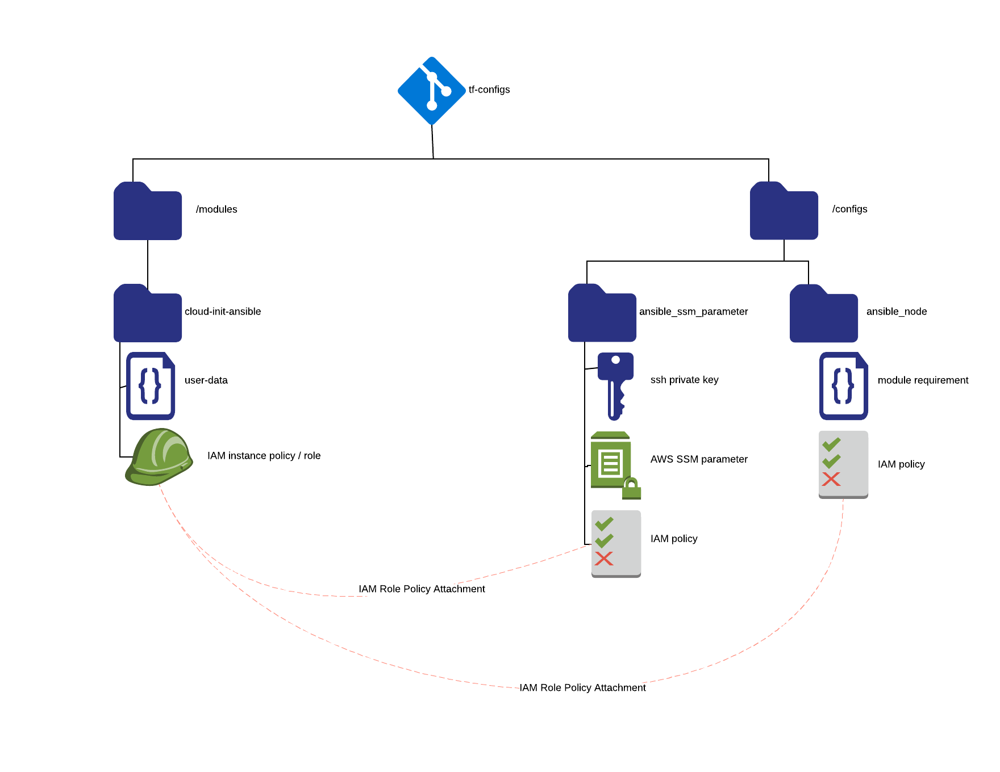

# Terraform Cloud Init Ansible


### [View all Roadmaps](https://github.com/nholuongut/all-roadmaps) &nbsp;&middot;&nbsp; [Best Practices](https://github.com/nholuongut/all-roadmaps/blob/main/public/best-practices/) &nbsp;&middot;&nbsp; [Questions](https://www.linkedin.com/in/nholuong/)
<br/>

This module creates user-data for Amazon EC2 instances to run ansible through cloud-init.
Along with the user-data, it stores an SSH private key in AWS SSM Parameter Store and 
create an IAM profile allowing read access to the stored parameter.  In your own config,
you can attach additional IAM policies to the module's IAM role output.

The TF\_VAR\_STORE\_ANSIBLE\_GIT\_KEY environment variable controls whether this module will
store the SSH key in SSM Parameter Store.

The module injects environment variables into the user-data:

* ENV is the environment that the EC2 instance resides in (e.g. development, production)
* ORG is the organization that the EC2 instance belongs to (e.g. your company name)
* HOSTGROUP places the EC2 instance into an Ansible host group (like a Chef role)
* ANSIBLE\_PLAYBOOKS\_REPO is the URL of your Ansible playbooks Git repository
* ANSIBLE\_SEED\_VARS is meant for variables you would use in your first ansible-playbook run

All EC2 instances will end up in two host groups -- `$ENV` and `$HOSTGROUP` -- if you use the
hostgroup.py inventory script, from the examples folder, in your ansible repo's inventory scripts.

# Setup



By including the module and passing in some variables, you will end up with an IAM instance
profile that allows your EC2 instance to retrieve a private SSH key.  This key is for use
with ansible-pull (or git clone). 

## Including the module

Note that in this directory, there is a script called "create-skel.sh."  
The script will create a \_bootstrap.tf file in the root of your config.
Optionally, you can edit the \_bootstrap.tf file and change some of the values:

| Variable (TF\_VAR\_\*)          | Purpose                                                                 | Default             |
|---------------------------------|-------------------------------------------------------------------------|---------------------|
| ENV                             | The name of your environment (e.g. prod, dev, staging)                  | None                |
| ORG                             | The name of your organization (e.g. 'ivytech')                          | None                |
| HOSTGROUP                       | The name of the hostgroup that this host belongs to (e.g. 'webservers') | None                |
| ANSIBLE\_GIT\_KEY               | SSH key file name                                                       | ~/.ssh/ansible\_rsa |
| ANSIBLE\_PLAYBOOKS\_REPO        | The git repository for your Ansible Playbooks                           | None                |
| ANSIBLE\_SEED\_VARS             | A here document that becomes /etc/ansible-local/seed.txt                | ""                  |
| STORE\_ANSIBLE\_GIT\_KEY        | Stores the Ansible git private key in SSM Parameter Store               | false               |

## Example: creating the SSM parameter

The \_bootstrap.tf and \_variables.tf files in the examples folder actually create a private SSH key and store them
in an AWS SSM parameter.

# User-data

There are user-data outputs, `debian`, `centos`, and `redhat`:

Just insert the results of the module in your user_data, when creating an instance or a launch config:

```
resource "aws_instance" "mine" {
  ami           = "${module.redhat_ami.id}"
  user_data     = "${module.cloud_init_ansible.redhat_user_data}"
  tags {
    Environment = "${var.ENV}"
  }
}
```

# Seed variables

Ansible may need some data that depends on terraform during runtime, e.g. connecting an EC2
instance to an ECS cluster.  By filling out the here document in \_bootstrap.tf with 
key-value pairs, you can pass these variables into /etc/ansible-local/seed.txt on the 
target system(s).  Here, we pass the ARN of the ECS cluster currently being created to
Ansible, which can link the ECS agent to it on bootstrap:

```
locals {
  seed = <<EOV
ECS_CLUSTER="${aws_ecs_cluster.current.arn}"
EOV
}
```

# Using the IAM instance profile

There are outputs for IAM instance profiles and roles: `iam_instance_profile_id` and `iam_role_name`.
For example, attach a profile to an EC2 instance:

```
resource "aws_instance" "mine" {
  ami                  = "${module.redhat_ami.id}"
  iam_instance_profile = "${module.cloud_init_ansible.iam_instance_profile_id}"
  ...
  tags {
    Environment        = "${var.ENV}"
  }
}
```

# Attaching additional IAM policies

Or, extend an EC2 instance's permissions by creating a new policy and attaching it to the IAM role:

```
resource "aws_iam_policy_attachment" "s3_get_items_policy" {
  roles      = ["${module.cloud_init_ansible.iam_role_name}"]
  policy_arn = "${aws_iam_policy.s3_get_items.arn}"
}
```

# Optional features

You can extend the instance's IAM role to support CloudWatch and Simple Systems Management by using
two additional environment variables:

| Variable (TF\_VAR\_\*)          | Purpose                                                                 | Default             |
|---------------------------------|-------------------------------------------------------------------------|---------------------|
| ENABLE\_AWS\_MANAGEMENT\_AGENTS | Add RestrictedEC2RoleforSSM and CloudWatchAgentServerPolicy to IAM role | true                |
| CREATE\_AWS\_MANAGEMENT\_POLICY | Create an EC2 policy allowing SSM and Cloudwatch agents to work         | false               |

This module will create a restricted EC2 policy like AWS's "AmazonEC2RoleforSSM" managed
policy.  Note that AWS's managed policy allows unrestricted read access to S3!

# TODO

I use Red Hat Enterprise Linux at my current job.  Because you can't install any packages, or 
pretty much do anything with RHEL before registering your license, we have a Packer template 
that takes care of things like installing Python, pip, Ansible, and AWS packages.

The debian (ok, ubuntu) template needs rehashed.

# 🚀 I'm are always open to your feedback.  Please contact as bellow information:
### [Contact ]
* [Name: nho Luong]
* [Skype](luongutnho_skype)
* [Github](https://github.com/nholuongut/)
* [Linkedin](https://www.linkedin.com/in/nholuong/)
* [Email Address](luongutnho@hotmail.com)


[](https://ko-fi.com/nholuong)

# License
* Nho Luong (c). All Rights Reserved.🌟